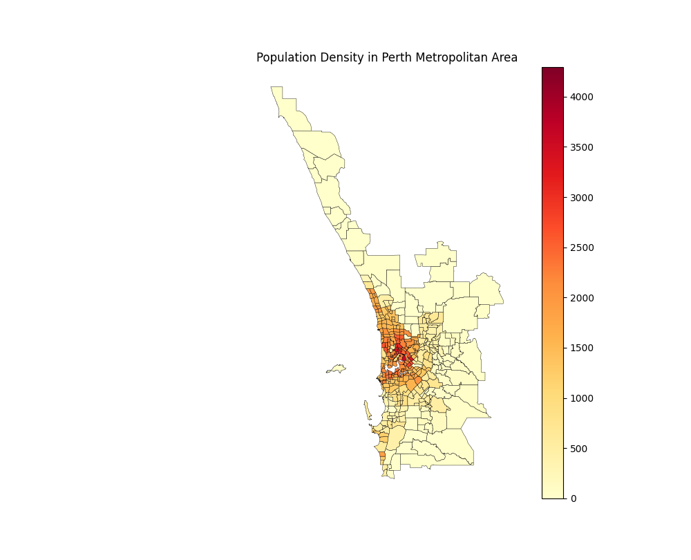

# Introduction

The data_loader.py module encapsulates the loading and preprocessing of the GeoPackage and Census data.

The preprocessing workflow includes:

- Loading the raw data into DataFrames.
- Aggregating land area by postcode.
- Calculating postcode-based population density.

# Examples

The data can be loaded by calling `the load_locality_data()` function:

```python
from scripts.dataloader import load_locality_data

localities = load_locality_data()
```

If the working directory differs from the default location, a custom base path for the datasets can be provided:

```python
from scripts.dataloader import load_locality_data

BASE_PATH = Path('data')
localities = load_locality_data(BASE_PATH)
```

The function returns a GeoPandas GeoDataFrame containing geographic information covering the entire state of Western Australia.

# Metadata

The localities `GeoDataFrame` contains several fields. The following fields are particularly useful for this project:

|Feild|Type|Description|
|--|--|--|
|`name`|object(str)|The name of the suburb|
|`postcode`|int64|The postcode of the suburb||
|`land_area`|float64|The land area of the suburb in square metres|
|`population_density_km2`|float64|The population density of the suburb in people per square kilometre|

A heatmap visualization of Perth Metropolitan Area is:

```python
BASE_PATH = Path('data')

localities = load_locality_data(BASE_PATH)

print(localities['population_density_km2'][0:5])

metro = localities[
    localities["postcode"].astype(int).between(6000,6199)
]

import matplotlib.pyplot as plt

fig, ax = plt.subplots(figsize=(10, 10))

metro.plot(
    ax=ax,
    column="population_density_km2",
    cmap="YlOrRd",
    legend=True,
    edgecolor="black",
    linewidth=0.3
)

ax.set_title("Population Density in Perth Metropolitan Area")
ax.set_axis_off()

plt.show()
```

Output:


