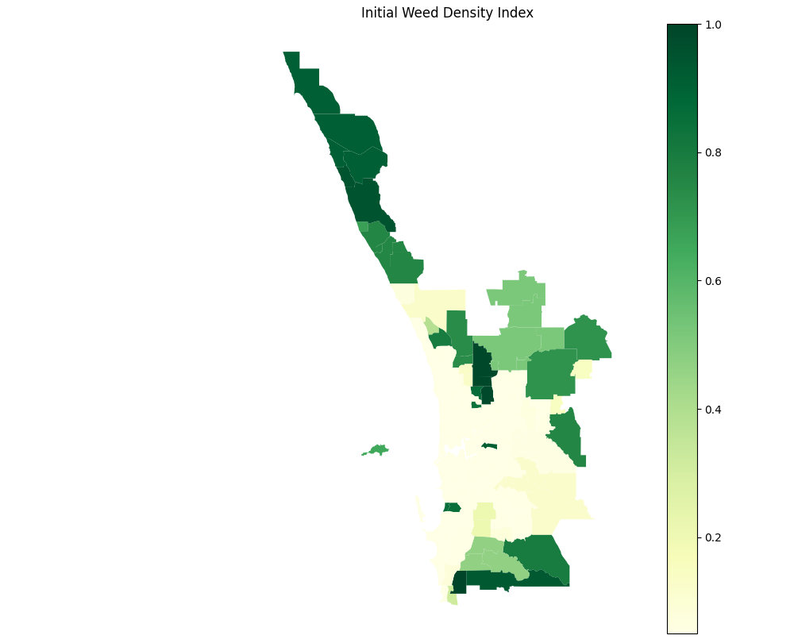

# Introduction

This project aims to simulate weed spread across the Perth metropolitan area using GIS data.

Following the concept of a celluar automata, population density data are used to construct a spatially varying initial weed density index. The resulting spatial distribution is then converted into a raster/grid representation, which serves as the initial state of the cellular automaton.

At each time step, the model simulates natural weed growth and spatial propagation between neighbouring cells.

# Key Assumptions

Accurate, large-scale weed density data are difficult to obtain. Existing weed observations are generally collected as point-based field observations rather than continuous, large-scale mesh or raster datasets, making them difficult to directly incorporate into the proposed cellular automaton model.

Therefore, this experiment adopts the following key assumption:

> Areas with higher population density generally have less available space for weed growth and are subject to greater levels of human management and suppression. Therefore, their weed density is assumed to be relatively lower.

Based on this assumption, a population-density-based proxy model is constructed to generate the initial weed density index.

## Exponential Decay Model

The simplest formulation is an exponential decay model:

$$
W=W_{cap} e^{-kD}
$$

Where

- W - weed density index
- $W_{cap}$ - maximum weed density index (cap limit) for each grid cell
- D - Population density (people / $km^2$)
- k - pressure coefficient controlling the strength of human suppression

An extended version introduces both lower and upper bounds:

$$
W=W_{min}+(W_{max}−W_{min})e^{−kD}
$$

This formulation constrains the weed density index within a predefined range and prevents it from approaching zero in areas with very high population density.

E.g. a simulated weed index heat map at presure coefficient = 0.05

## weed occurrence probability

Alternatively, a weed occurrence probability can be used to represent the likelihood that a cell contains or develops weeds:

$$
P(weed) = \frac{1}{1+e^{a+bD}}
$$

where $a$ controls the baseline occurrence probability and $b$ controls the effect of population density.

This formulation represents the assumption that human activity influences the persistence and establishment of weeds. It can subsequently be incorporated into the time-step update rules. For example, cells with higher population density may have a lower probability of natural weed establishment, while weed propagation from neighbouring cells may remain an important source of spread.

# Cell Update Rules

## Natural Growth

Weeds grow within individual cells, so the weed density index of a cell can increase over time.

When sufficient space and resources are available, the weed population is assumed to increase according to a growth function.

## Cap limit

Each cell has a maximum carrying capacity determined by available space and resources.

As the weed density approaches the carrying capacity, its growth rate decreases. Therefore, a logistic or other saturating growth function may be used to represent the expected S-shaped growth curve:

$$
\frac{dW}{dt} = rW\left(1-\frac{W}{W_{cap}}\right)
$$

where:

- $r$ — intrinsic growth rate
- $W$ — current weed density index
- $W_{cap}$ — carrying capacity of the cell

This prevents unlimited growth and ensures that the simulated weed density eventually approaches a stable upper limit.

## Diffusion and Spatial Spread

Weeds can spread from one cell to neighbouring cells.

At each time step, weed propagation is influenced by the density difference between neighbouring cells. Weeds are therefore assumed to spread preferentially from cells with higher weed density towards neighbouring cells with lower weed density, following a diffusion-like mechanism.

A simplified diffusion term can be expressed as:

$$
\Delta W_i = D_w \sum_{j \in N(i)} (W_j-W_i)
$$

where:

- $W_i$ — weed density of the current cell
- $W_j$ — weed density of a neighbouring cell
- $N(i)$ — set of neighbouring cells
- $D_w$ — weed diffusion coefficient

This mechanism allows high-density weed patches to gradually propagate into surrounding low-density cells.

Considering all three factors, the weed index formula along timesteps can be:

$$ W_i^{t+1} = W_i^t + \underbrace{rW_i^t(1-W_i^t/W_{cap})}_{\text{natural growth}} + \underbrace{D_w\sum_{j\in N(i)}(W_j^t-W_i^t)}_{\text{diffusion}} - \underbrace{R_i^t}_{\text{removal}} $$

# Additional Experiments

If time permits, additional experiments can be conducted to investigate potential weed-control strategies.

## Control Policy A: Concentrated Weed Removal

Apply targeted weed-removal operations to cells with high weed density.

The objective is to investigate whether concentrating limited removal resources in high-density areas can reduce the overall weed population or slow its spatial expansion.

## Control Policy B: Buffer Zone

Create a buffer belt between heavily infested areas and surrounding cells.

The objective is to investigate whether reducing connectivity between high-density weed patches can mitigate spatial propagation.

## Cost Analysis

A simplified cost model can be introduced to evaluate the economic implications of different control strategies.

For example, a reference removal cost could be defined as:

> AUD $100 per 0.1 weed index per grid

The total cost of a control strategy can then be estimated from the number and area of cells requiring treatment.

This allows different intervention strategies to be compared in terms of both their simulated effectiveness and operational cost.
